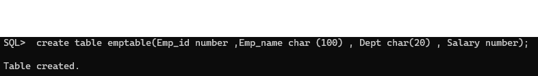
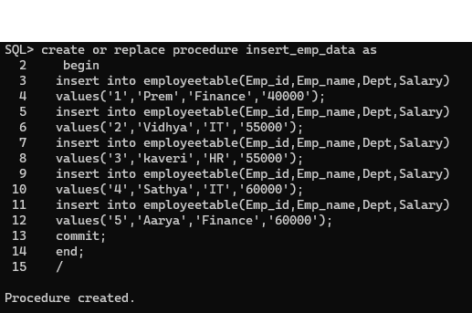
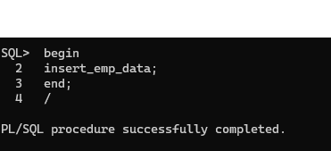
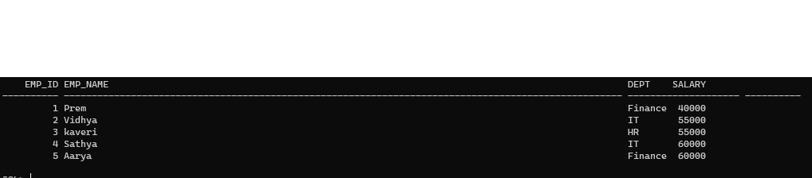

# Ex. No: 4 Creating Procedures using PL/SQL
## DATE:
### AIM: 
To create a procedure using PL/SQL.

### Steps:
1. Create employee table with following attributes (empid NUMBER, empname VARCHAR(10), dept VARCHAR(10),salary NUMBER);
2. Create a procedure named as insert_employee data.
3. Inside the procdure block, write the query for inserting the values into the employee table.
4. End the procedure.
5. Call the insert_employee data procedure to insert the values into the employee table.
6. Display the employee table

### Program:
## Create the table:
```
 create table employeetable(Emp_id number ,Emp_name char (100) , Dept char(20) , Salary number);
 ```
## Create procedure:
```
 create or replace procedure insert_emp_data as
   begin
  insert into employeetable(Emp_id,Emp_name,Dept,Salary)
  values('1','Prem','Finance','40000');
  insert into employeetable(Emp_id,Emp_name,Dept,Salary)
  values('2','Vidhya','IT','55000');
  insert into employeetable(Emp_id,Emp_name,Dept,Salary)
  values('3','kaveri','HR','55000');
  insert into employeetable(Emp_id,Emp_name,Dept,Salary)
  values('4','Sathya','IT','60000');
  insert into employeetable(Emp_id,Emp_name,Dept,Salary)
  values('5','Aarya','Finance','60000');
  commit;
  end;
 ```
 ## Call Procedure:
 ```
 begin
 insert_emp_data;
 end;
 /
 ```
## Display Table:
```
select * from employeetable;
```
### Output:
## Create Table:

## Create procedure:

## Call Procedure:

## Display Table:

### Result:
Thus, a procedure is created successfully by using PL/SQL.
